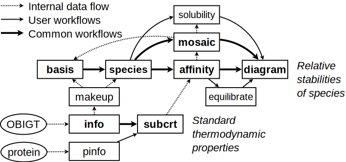

<style>
html { 
  font-size: 14px;
}
body {
  font-family: ‘Times New Roman’, Times, serif;
}
li {
  padding: 0.25rem 0;
}
/* zero margin around pre blocks (looks more like R console output) */
pre {
  margin-top: 0;
  margin-bottom: 0;
}
</style>

```{r options, include=FALSE}
options(width = 80)
options(digits = 6)
```

```{r HTML, include=FALSE}
## some frequently used HTML expressions
logfO2 <- "log<i>f</i><sub>O<sub>2</sub></sub>"
# use lowercase here because these tend to be variable names in the examples
zc <- "<i>Z</i><sub>C</sub>"
o2 <- "O<sub>2</sub>"
h2o <- "H<sub>2</sub>O"
sio2 <- "SiO<sub>2</sub>"
ch4 <- "CH<sub>4</sub>"
```

```{r setup, include=FALSE}
library(knitr)

## from "Tufte Handout" example dated 2016-12-27
# invalidate cache when the tufte version changes
opts_chunk$set(tidy = FALSE, cache.extra = packageVersion('tufte'))
options(htmltools.dir.version = FALSE)

## adjust plot margins
## first one from https://yihui.name/knitr/hooks/
knit_hooks$set(small.mar = function(before, options, envir) {
    if (before) par(mar = c(4.2, 4.2, .1, .1))  # smaller margin on top and right
})
knit_hooks$set(tiny.mar = function(before, options, envir) {
    if (before) par(mar = c(.1, .1, .1, .1))  # tiny margin all around
})
knit_hooks$set(smallish.mar = function(before, options, envir) {
    if (before) par(mar = c(4.2, 4.2, 0.9, 0.9))  # smallish margins on top and right
})

## use pngquant to optimize PNG images
knit_hooks$set(pngquant = hook_pngquant)
pngquant <- "--speed=1 --quality=0-25"
# pngquant isn't available on R-Forge ...
if (!nzchar(Sys.which("pngquant"))) pngquant <- NULL 

## use a low resolution to save space in the package
# change this to 72 to make higher-resolution images for the CHNOSZ web page
dpi <- 50

## http://stackoverflow.com/questions/23852753/knitr-with-gridsvg
## Set up a chunk hook for manually saved plots.
knit_hooks$set(custom.plot = hook_plot_custom)

## hook to change  to <embed /> -- required for interactive SVG
hook_plot <- knit_hooks$get("plot")
knit_hooks$set(plot = function(x, options) {
  x <- hook_plot(x, options)
  if (!is.null(options$embed.tag) && options$embed.tag) x <- gsub("%s</pre>', color, x)
}
knit_hooks$set(warning = color_block('magenta'), error = color_block('red'), message = color_block('blue'))
```

# Overview

This vignette was made for version `r sessionInfo()$otherPkgs$CHNOSZ$Version` of CHNOSZ, a package for the [R software environment](https://www.r-project.org/).
For more information on R, see "[An Introduction to R](https://cran.r-project.org/manuals.html)" and the [contributed documentation](https://cran.r-project.org/other-docs.html) for R.

CHNOSZ has been developed since 2006 as a tool for thermodynamic calculations in geochemistry and compositional biology.
The package provides functions and a thermodynamic database that can be used to calculate the stoichiometric and energetic properties of reactions involving minerals and inorganic and/or organic aqueous species.
These functions also enable calculations of chemical affinities and metastable equilibrium distributions of proteins.
A major feature of the package is the production of diagrams to visualize the effects of changing temperature, pressure, and activities of basis species on the potential for reactions among various species.

## Installing and loading CHNOSZ

After starting R, install CHNOSZ by selecting the "Install packages from CRAN" or similar menu item in the R GUI or by using the following command:
```{r install_CHNOSZ, eval=FALSE}
install.packages("CHNOSZ")
```

Then load the CHNOSZ package to make its data and functions available in your R session:
```{r library_CHNOSZ}
library(CHNOSZ)
```

CHNOSZ is now ready to go with the default thermodynamic database and an empty system definition.
After running some calculations, you may want to "start over" with the default values.
To clear the system settings and restore the default thermodynamic database, use <span style="color:red">`reset()`</span>.
```{r reset}
reset()
```

Note: Throughout this document, syntax highlighting is applied to the *input* of the code chunks.
Double hash marks (`##`) precede the *output*, where black text denotes *results* and blue text is used for *messages*.

## Getting help

After CHNOSZ is installed, type <span style="color:blue">`help.start()`</span> to browse the R help documents, then choose "Packages" followed by "CHNOSZ".
That shows an index of the *manual* (help pages) for each function; many of the help pages include examples.
There are also links to the *demos* (longer examples) and *vignettes* (more in-depth documentation; this document is a vignette).

Suggestions for accessing the documentation are indicated here with <span style="color:blue">blue text</span>.
For example, read <span style="color:blue">``?`CHNOSZ-package` ``</span> to get an overview of the package and a list of features.
```{marginfigure}
"`?`" is a shortcut to R's `help()` function.
The command here is equivalent to <span style="color:blue">`help("CHNOSZ-package")`</span>.
```

## Organization of major functions

CHNOSZ is made up of a set of functions and supporting datasets.
The major components of the package are shown in the figure below, which is an updated version of the diagram in @Dic08.
Rectangles and ellipses represent functions and datasets; bold text indicates primary functions.

<!-- https://stackoverflow.com/questions/14675913/how-to-change-image-size-markdown -->
{ width=75% }

Many functions in CHNOSZ have no side effects.
That is, the function only returns a result; to use the result elsewhere, it can be assigned to a variable with `<-`.
In this document, the names of these functions are shown in <span style="color:green">green text</span> (not applicable to the code chunks).
```{marginfigure}
When they are mentioned, names of functions in the base and recommended packages of R are said to belong to R.
Example: Use R's `plot()` to plot the data.
```
Major functions without side effects in CHNOSZ are:

* <span style="color:green">`info()`</span>: search for species in the thermodynamic database;
* <span style="color:green">`subcrt()`</span>: calculate the thermodynamic properties of species and reactions;
* <span style="color:green">`affinity()`</span>: calculate the affinities of formation reactions using given chemical activities;
* <span style="color:green">`equilibrate()`</span>: calculate the equilibrium chemical activities of the species of interest;
* <span style="color:green">`diagram()`</span>: plot the results.

Some functions in CHNOSZ do have side effects: they modify the `thermo` data object in the current R session.
In this document, the names of these functions are shown in <span style="color:red">red text</span> (but not in the code chunks).
Major functions with side effects are:

* <span style="color:red">`basis()`</span>: set the basis species and their chemical activities;
* <span style="color:red">`species()`</span>: set the species of interest and their (non-equilibrium) chemical activities;
* <span style="color:red">`reset()`</span>: reset the database, restoring all settings to their default values.

The following pseudocode shows a common sequence of commands.
In actual usage, the `...` are replaced by arguments that define the chemical species and variables:
```{r pseudocode, eval=FALSE}
basis(...)
species(...)
a <- affinity(...)
e <- equilibrate(a)  ## optional
diagram(e)           ## or diagram(a)
reset()         ## clear settings for next calculation
```

# Querying the thermodynamic database

## The <span style="color:green">`info()`</span> function

<span style="color:green">`info()`</span> provides an interface to the OBIGT thermodynamic database that is packaged with CHNOSZ.
Suppose you are interested in the thermodynamic properties of aqueous methane.
Because the database is assembled with aqueous species first, they take precedence over other states.
Searching by chemical formula alone gives the first matching species, in this case aqueous methane:
```{r info_CH4}
info("CH4")
```

The number that is returned is the species index in the database.
A second argument can be used to specify a physical state with lower precedence:
```{r info_CH4_gas}
info("CH4", "gas")
```

While some species are identified only by chemical formula, others have distinct names (in English) listed in the database.
For `r ch4` and inorganic substances that are represented by both gaseous and aqueous forms, the name is applied only to the gas.
However, the names of organic substances other than methane are applied to aqueous species, which have precedence, and those in other states.
The following commands get the species indices for some common gases:
```{r info_names_gas}
info("methane")
info("oxygen")
info("carbon dioxide")
```

A special case is sulfur; the name refers to both the native mineral, which has precedence, and the gas.
These two phases can be identifed with the formulas S<sub>2</sub> and S, respectively.
```{r info_S_S2}
info("S")
info("S2")
```

Taking the species number of aqueous methane returned by <span style="color:green">`info()`</span>, use the function again to retrieve the set of standard molal thermodynamic properties and equations of state parameters:
```{r iCH4, message=FALSE}
iCH4 <- info("CH4")
info(iCH4)
```

Liquid water is species number 1; it has NA entries in the database because dedicated functions are used to compute its properties:
```{r info_info_water}
info(info("water"))
```

## Fuzzy searches

Calling <span style="color:green">`info()`</span> with a string that does not exactly match the name of any species invokes a fuzzy search of the database:
```{r width180, include=FALSE}
options(width = 180)
```
```{r info_acid}
info("acid")
```
```{r width80, include=FALSE}
options(width = 80)
```

The message includes e.g. "uracil" and "metacinnabar" because their names have some similarity to the search term.
Since "ribose" is the name of a species in the database, to find species with similar names, add an extra character to the search:
```{r info_ribose}
info(" ribose")
```

The messages may be useful for browsing the database, but owing to their ambiguous results, these fuzzy searches return an `NA` value for the species index.

## Counting elements, chemical formulas, <span style="color:green">`ZC()`</span>

Continuing with the example of aqueous methane, let's look at its chemical formula:
```{r info_CH4_formula, message=FALSE}
info(iCH4)$formula
```

We can use <span style="color:green">`makeup()`</span> to count the elements in the formula, followed by <span style="color:green">`as.chemical.formula()`</span> to rewrite the formula on one line:
```{r makeup_iCH4}
makeup(iCH4)
as.chemical.formula(makeup(iCH4))
```

For organic species, a calculation of the average oxidation state of carbon (`r zc`) is possible given the species index, chemical formula, or elemental count:
```{r ZC_iCH4, message=FALSE}
ZC(iCH4)
ZC(info(iCH4)$formula)
ZC(makeup(iCH4))
```

# Calculating thermodynamic properties

To calculate the standard molal properties of species and reactions, use <span style="color:green">`subcrt()`</span>.
The name of this function is derived from the SUPCRT package [@JOH92], which is also the source of the Fortran subroutine used to calculate the thermodynamic properties of H<sub>2</sub>O.

If no reaction coefficients are given, <span style="color:green">`subcrt()`</span> calculates the standard molal properties of individual species:
```{r subcrt_water}
subcrt("water")
```

That uses the default temperature and pressure settings, i.e. equally spaced temperature intervals from 0 to 350 °C at *P*<sub>sat</sub>, i.e. 1 bar below 100 °C, or the pressure of liquid-vapor saturation (i.e. boiling) at higher temperatures.
The columns in the output are temperature, pressure, density of water, logarithm of the equilibrium constant (only meaningful for reactions; [see below](#properties-of-reactions)), standard molal Gibbs energy and enthalpy of formation from the elements, standard molal entropy, volume, and heat capacity.
```{marginfigure}
The corresponding units are °C (`T`), bar (`P`), g cm<sup>-3</sup> (`rho`), cal mol<sup>-1</sup> (`G` and `H`), cal K<sup>-1</sup> mol<sup>-1</sup> (`S` and `Cp`), and cm<sup>3</sup> mol<sup>-1</sup> (`V`).
```

A custom temperature-pressure grid can be specified.
Here, we calculate the properties of `r h2o` on a *T*, *P* grid in the supercritical region, with conditions grouped by pressure:
```{r subcrt_water_grid}
subcrt("water", T = c(400, 500, 600), P = c(200, 400, 600), grid = "P")$out$water
```

```{r subcrt_water_plot, fig.margin=TRUE, fig.width=4, fig.height=4, small.mar=TRUE, dpi=dpi, out.width="100%", echo=FALSE, message=FALSE, fig.cap="Isothermal contours of density (g cm<sup>-3</sup>) and pressure (bar) of water.", cache=TRUE, pngquant=pngquant, timeit=timeit}
sres <- subcrt("water", T=seq(0,1000,100), P=c(NA, seq(1,500,1)), grid="T")
water <- sres$out$water
plot(water$P, water$rho, type = "l")
```
The additional operations (`$out$water`) are used to extract a specific part of the results; this can be used with e.g. R's `write.table()` or `plot()` for further processing:
```{r subcrt_water_plot, eval=FALSE}
```

## Changing units

The default units of temperature, pressure, and energy in the input and output of <span style="color:green">`subcrt()`</span> are °C, bar, and Joules.
The functions <span style="color:red">`T.units()`</span>, <span style="color:red">`P.units()`</span>, and <span style="color:red">`E.units()`</span> can be used to change the units used by <span style="color:green">`subcrt()`</span> and some other functions in CHNOSZ.
What is the Gibbs energy in J/mol (the default) and cal/mol of aqueous methane at 298.15 K and 0.1 MPa?
```{r units_CH4}
T.units("K")
P.units("MPa")
subcrt("CH4", T = 298.15, P = 0.1)$out$CH4$G
E.units("cal")
subcrt("CH4", T = 298.15, P = 0.1)$out$CH4$G
```

The parameters for each species in the OBIGT database have the units indicated by the `E_units` column there, which is independent of the setting of <span style="color:red">`E.units()`</span>.
Unlike <span style="color:green">`subcrt()`</span>, <span style="color:green">`info()`</span> always displays the database values in the units given in the database.
A separate function, <span style="color:green">`convert()`</span>, can be used to convert values to selected units.
The following code shows that the database parameters for CH<sub>4</sub>(aq) are in calories, then converts the standard Gibbs energy from cal/mol to J/mol.
```{r convert_G, message=FALSE}
(CH4dat <- info(info("CH4")))
convert(CH4dat$G, "J")
```

Note that converting the database value to J/mol gives the same result as running `subcrt("CH4", T = 25)` with the default <span style="color:red">`E.units()`</span> setting of J.

Use <span style="color:red">`reset()`</span> to restore the units and all other settings for CHNOSZ to their defaults:
```{r reset}
```

# Properties of reactions

## Reaction definitions

To calculate the thermodynamic properties of reactions, give the names of species, the physical states (optional), and reaction coefficients as the arguments to <span style="color:green">`subcrt()`</span>.
Here we calculate properties for the dissolution of CO<sub>2</sub>.
This doesn't correspond to the _solubility_ of CO<sub>2</sub>; see the [solubility section](#complete-equilibrium-solubility) in this vignette and [<span style="color:blue">`demo(solubility)`</span>](../demo) for examples of solubility calculations.
```{r subcrt_CO2}
subcrt(c("CO2", "CO2"), c("gas", "aq"), c(-1, 1), T = seq(0, 250, 50))
```

In order to make a plot like Figure 18 of @MSS13, let's run more calculations and store the results.
In addition to the reaction definition, we specify a greater number of temperature points than the default:

```{r CO2_logK, echo=FALSE, message=FALSE}
T <- seq(0, 350, 10)
CO2 <- subcrt(c("CO2", "CO2"), c("gas", "aq"), c(-1, 1), T = T)$out$logK
CO <- subcrt(c("CO", "CO"), c("gas", "aq"), c(-1, 1), T = T)$out$logK
CH4 <- subcrt(c("CH4", "CH4"), c("gas", "aq"), c(-1, 1), T = T)$out$logK
logK <- data.frame(T, CO2, CO, CH4)
```
```{r CO2_plot, fig.margin=TRUE, fig.width=4, fig.height=4, small.mar=TRUE, dpi=dpi, out.width="100%", echo=FALSE, message=FALSE, fig.cap="Calculated equilibrium constants for dissolution of CO<sub>2</sub>, CO, and CH<sub>4</sub>.", cache=TRUE, pngquant=pngquant, timeit=timeit}
matplot(logK[, 1], logK[, -1], type = "l", col = 1, lty = 1,
        xlab = axis.label("T"), ylab = axis.label("logK"))
text(80, -1.7, expr.species("CO2"))
text(240, -2.37, expr.species("CO"))
text(300, -2.57, expr.species("CH4"))
```
```{r CO2_logK, eval=FALSE}
```

Now we can make the plot, using R's `matplot()`.
Here, <span style="color:green">`axis.label()`</span> and <span style="color:green">`expr.species()`</span> are used to create formatted axis labels and chemical formulas:
```{r CO2_plot, eval=FALSE}
```

## Unbalanced reactions

A balanced chemical reaction conserves mass.
<span style="color:green">`subcrt()`</span> won't stop you from running an unbalanced reaction, but it will give you a warning:
```{r subcrt_unbalanced, results="hide"}
subcrt(c("CO2", "CH4"), c(-1, 1))
```

In other words, to balance the reaction, we should add 4 H to the left and 2 O to the right.
That could be done manually be redefining the reaction with the appropriate species.
There is another option: balancing the reaction automatically using basis species.

## Setting the basis species

_Basis species_ are a minimal number of chemical species that linearly combine to give the composition of any species in the system.
The basis species are similar to thermodynamic components, but can include charged species. 
Basis species are used in CHNOSZ to automatically balance reactions; they are also required for making chemical activity diagrams.

Let's start with an example that doesn't work:
```{r basis_singular, error=TRUE}
basis(c("CO2", "H2", "H2CO2"))
```

That set of species has a singular (non-invertible) stoichiometric matrix.
An error would also result from either an underdetermined or overdetermined system.
A valid set of basis species has an invertible stoichiometric matrix and the same number of species as elements:
```{r basis_CHO}
basis(c("CO2", "H2", "H2O"))
```
The composition of any species made up of C, H, and O can be represented by a single linear combination of these basis species.

## Automatically balancing reactions

Methanogenic metabolism in reducing environments may proceed by acetoclastic or hydrogenotrophic processes.
To consider reactions involving a charged species (acetate), let's define a basis with H<sup>+</sup>:
```{r basis_CHOZ}
basis(c("CO2", "H2", "H2O", "H+"))
```

By identifying species *other than* the basis species, the reactions will be automatically balanced.
This produces the balanced reaction for acetoclastic methanogenesis:
```{r subcrt_acetoclastic, message=FALSE}
subcrt(c("acetate", "CH4"), c(-1, 1))$reaction
```

We can similarly consider reactions for hydrogenotrophic methanogenesis as well as acetate oxidation (without production of methane):
```{r subcrt_methanogenesis, message=FALSE}
acetate_oxidation <- subcrt("acetate", -1)
hydrogenotrophic <- subcrt("CH4", 1)
acetoclastic <- subcrt(c("acetate", "CH4"), c(-1, 1))
```

Use <span style="color:green">`describe.reaction()`</span> to write the reactions on a plot:

```{r describe_reaction_plot, fig.margin=TRUE, fig.width=3.5, fig.height=1.8, tiny.mar=TRUE, dpi=dpi, out.width="100%", pngquant=pngquant, timeit=timeit}
plot(0, 0, type = "n", axes = FALSE, ann=FALSE, xlim=c(0, 5), ylim=c(5.2, -0.2))
text(0, 0, "acetoclastic methanogenesis", adj = 0)
text(5, 1, describe.reaction(acetoclastic$reaction), adj = 1)
text(0, 2, "acetate oxidation", adj = 0)
text(5, 3, describe.reaction(acetate_oxidation$reaction), adj = 1)
text(0, 4, "hydrogenotrophic methanogenesis", adj = 0)
text(5, 5, describe.reaction(hydrogenotrophic$reaction), adj = 1)
```

## Chemical affinity

Usually, <span style="color:green">`subcrt()`</span> returns only standard state thermodynamic properties.
```{marginfigure}
The standard state adopted for H<sub>2</sub>O is unit activity of the pure component at any *T* and *P*.
The standard state for aqueous species is unit activity of a hypothetical one molal solution referenced to infinite dilution at any *T* and *P*.
```
Thermodynamic models often consider a non-standard state (i.e. non-unit activity).
The activities of basis species can be modified with <span style="color:red">`basis()`</span>, and those of the other species using the `logact` argument in <span style="color:green">`subcrt()`</span>.

Let us calculate the chemical affinity of acetoclastic methanogenesis.
```{marginfigure}
The affinity is equal to the negative of the overall (non-standard) Gibbs energy change of the reaction.
```
We change the states of CO<sub>2</sub> and H<sub>2</sub> in the basis from `aq` (aqueous) to `gas`, and set the logarithm of fugacity of gaseous H<sub>2</sub> and the pH, using values from @MDS_13.
The activity of acetate and fugacity of methane, as well as temperature and pressure, are set in the call to <span style="color:green">`subcrt()`</span>:
```{r basis_mayumi, message=FALSE, results="hide"}
basis(c("CO2", "H2", "H2O", "H+"))
basis(c("CO2", "H2"), "gas")
basis(c("H2", "pH"), c(-3.92, 7.3))
```
```{r affinity_acetoclastic, message=FALSE}
subcrt(c("acetate", "CH4"), c(-1, 1),
       c("aq", "gas"), logact = c(-3.4, -0.18), T = 55, P = 50)$out
```

The new `A` column shows the affinity; the other columns are unaffected and still show the standard-state properties.
Let's repeat the calculation for hydrogenotrophic methanogenesis.
```{r affinity_hydrogenotrophic, message=FALSE}
subcrt("CH4", 1, "gas", logact = -0.18, T = 55, P = 50)$out
```

Under the specified conditions, the affinities of hydrogenotrophic and acetoclastic methanogenesis are somewhat greater than and less than 20 kJ, respectively.
This result matches Figure 4b in Mayumi et al. (2013) at unit fugacity of CO<sub>2</sub>.

We can go even further and reproduce their plot.
```{marginfigure}
The reproduction is not identical, owing to differences of thermodynamic data and of calculations of the effects of temperature and pressure.
```
To make the code neater, we write a function that can run any of the reactions:
```{r rxnfun, message=FALSE}
rxnfun <- function(coeffs) {
  subcrt(c("acetate", "CH4"), coeffs,
         c("aq", "gas"), logact = c(-3.4, -0.18), T = 55, P = 50)$out
}
```

Now we're ready to calculate and plot the affinities.
Here, we use R's `lapply()` to list the results at two values of logarithm of fugacity of CO<sub>2</sub>.
We insert an empty reaction to get a line at zero affinity.
R's `do.call()` and `rbind()` are used to turn the list into a data frame that can be plotted with R's `matplot()`.
There, we plot the negative affinities, equal to Gibbs energy, as shown in the plot of Mayumi et al. (2013).

```{r methanogenesis_plot, fig.margin=TRUE, fig.width=4.1, fig.height=4.1, small.mar=TRUE, dpi=dpi, out.width="100%", echo=FALSE, message=FALSE, fig.cap="Gibbs energies of acetate oxidation and methanogenesis (after Mayumi et al., 2013).", cache=TRUE, pngquant=pngquant, timeit=timeit}
Adat <- lapply(c(-3, 3), function(logfCO2) {
  basis("CO2", logfCO2)
  data.frame(logfCO2,
    rxnfun(c(0, 0))$A,
    rxnfun(c(-1, 0))$A,
    rxnfun(c(-1, 1))$A,
    rxnfun(c(0, 1))$A
  )
})
Adat <- do.call(rbind, Adat)
matplot(Adat[, 1], -Adat[, -1]/1000, type = "l", lty = 1, lwd = 2,
  xlab = axis.label("CO2"), ylab = axis.label("DG", prefix = "k"))
legend("topleft", c("acetate oxidation", "acetoclastic methanogenesis",
  "hydrogenotrophic methanogenesis"), lty = 1, col = 2:4)
```
```{r methanogenesis_plot, eval=FALSE}
```

Let's not forget to clear the system settings, which were modified by <span style="color:red">`basis()`</span>, before running other calculations:
```{r reset, message=FALSE}
```

# Using <span style="color:green">`affinity()`</span>

<span style="color:green">`affinity()`</span> offers calculations of chemical affinity of formation reactions over a configurable range of *T*, *P*, and activities of basis species.

## From affinity to diagrams

By *formation reaction* is meant the stoichiometric requirements for formation of one mole of any species from the basis species.
The <span style="color:red">`species()`</span> function is used to set these *formed species*.
Let's consider the stoichiometry of some aqueous sulfur-bearing species.
Here we use <span style="color:red">`basis()`</span> with a keyword to load a preset basis definition.
To use Eh as a variable, the electron (*e*<sup>-</sup>) should be in the basis, so we use the keyword (<span style="color:red">`basis("CHNOSe")`</span>).
```{marginfigure}
Some available keywords are `CHNOS` (including CO<sub>2</sub>, H<sub>2</sub>O, NH<sub>3</sub>, H<sub>2</sub>S, and O<sub>2</sub>), `CHNOS+` (also including H<sup>+</sup>), and `CHNOSe` (including H<sup>+</sup>, and *e*<sup>-</sup> instead of O<sub>2</sub>).
See <span style="color:blue">`?basis`</span> for more options.
```
```{marginfigure}
What is `SO42-`? Is it 1 S, 4 O, and 2 negative charges, or 1 S, 42 O, and 1 negative charge?
The ambiguity of a digit that could belong to the coefficient for the following charge or to that for the preceding element is why formulas in CHNOSZ are written with the number of charges after the + or - symbol.
`SO4-2` is unambiguously parsed as 1 S, 4 O and 2 negative charges.
```
```{r basis_CHNOSZ, results="hide"}
basis("CHNOSe")
```
```{r species_sulfur}
species(c("H2S", "HS-", "HSO4-", "SO4-2"))
```

Aqueous species are assigned default activities of 10<sup>-3</sup> (`logact` is -3).
Now, we can use <span style="color:green">`affinity()`</span> to calculate the affinities of the formation reactions of each of the species.
R's `unlist()` is used here to turn the list of values of affinity into a numeric object that can be printed in a couple of lines (note that the names correspond to `ispecies` above):
```{r affinity}
unlist(affinity()$values)
```

The values returned by <span style="color:green">`affinity()`</span> are dimensionless, i.e. *A*/(2.303*RT*).
Although <span style="color:green">`subcrt()`</span> can also calculate affinities (in units of cal/mol or J/mol), the main advantage of <span style="color:green">`affinity()`</span> is that it can perform calculations on an arbitrary grid of *T*, *P*, or activities of basis species.
This is the foundation for making many types of diagrams that are useful in geochemistry.

Given the values of affinity, the <span style="color:green">`diagram()`</span> function identifies the species that has the maximum affinity at each grid point.
The result is equivalent to a "predominance diagram" [@Dic19], where the fields represent the predominant aqueous species and the boundaries are equal-activity lines.
If both aqueous species and minerals are present, it is common practice to assign a constant activity to all aqueous species and unit activity (i.e. log activity = 0) for minerals.
More sophisticated diagrams can be made by showing the solubility contours of a metal on the diagram; see [<span style="color:blue">`demo(contour)`</span>](../demo) for an example.

```{r EhpH_plot, fig.margin=TRUE, fig.width=4, fig.height=4, dpi=dpi, out.width="100%", echo = FALSE, message=FALSE, cache=TRUE, fig.cap="Aqueous sulfur species at 25 °C.", pngquant=pngquant, timeit=timeit}
a <- affinity(pH = c(0, 12), Eh = c(-0.5, 1))
diagram(a, limit.water = TRUE)
```
Let's use <span style="color:green">`diagram()`</span> to make a simple Eh-pH diagram for aqueous species in the system S-O-H.
After running the <span style="color:red">`basis()`</span> and <span style="color:red">`species()`</span> commands above, we can calculate the affinities on an Eh-pH grid.
With the default settings in <span style="color:green">`diagram()`</span>, areas beyond the stability limits of water are colored gray.
This can be changed by setting the `limit.water` argument to FALSE (to not show the stability region of water) or TRUE (to plot the main diagram only in the stable region of water).
The names of species that can be parsed as chemical formulas are formatted with subscripts and superscripts; if this is not desired, set `format.names = FALSE`.
```{r EhpH_plot, echo=TRUE, eval=FALSE}
```

```{r EhpH_plot_color, fig.margin=TRUE, fig.width=4, fig.height=4, smallish.mar=TRUE, dpi=dpi, out.width="100%", echo=FALSE, message=FALSE, cache=TRUE, fig.cap="The same plot, with different colors and labels.", pngquant=pngquant, timeit=timeit}
diagram(a, fill = "terrain", lwd = 2, lty = 3,
        names = c("hydrogen sulfide", "bisulfide", "bisulfate", "sulfate"),
        las = 0)
water.lines(a, col = 6, lwd = 2)
```
Other arguments in <span style="color:green">`diagram()`</span> can be used to control the line type (`lty`), width (`lwd`), and color (`col`), field colors (`fill`), and species labels (`name`).
Additional arguments are passed to R's plotting functions; here, we use `las` to change the orientation of axes labels.
Another function, <span style="color:green">`water.lines()`</span>, can be used to draw lines at the water stability limits:
```{r EhpH_plot_color, echo=TRUE, eval=FALSE}
```

See the demos in the package for other examples of Eh-pH diagrams.
In particular, [<span style="color:blue">`demo(Pourbaix)`</span>](../demo) shows how to plot the concentrations of metals as equisolubility (or isosolubility) lines on Eh-pH diagrams [@Pou74].

Mineral stability diagrams often depict activity ratios, e.g. log (*a*<sub>Ca<sup>+2</sup></sub>/*a*<sub>H<sup>+</sup></sub><sup>2</sup>), on one or both axes.
The variables used for potential calculations in CHNOSZ include only a single chemical activity, e.g. log *a*<sub>Ca<sup>+2</sup></sub>.
However, you can set pH = 0 to generate diagrams that are geometrically equivalent to those calculated using activity ratios, and use <span style="color:green">`ratlab()`</span> to make the axes labels for the ratios.
Moreover, <span style="color:green">`diagram()`</span> has a "saturation" option that can be used to draw saturation limits for minerals that do not contain the conserved basis species.
See [<span style="color:blue">`demo(saturation)`</span>](../demo) for an example that uses activity ratios on the axes and plots saturation limits for calcite, magnesite, dolomite, and brucite on a diagram for the H<sub>2</sub>O&ndash;CO<sub>2</sub>&ndash;CaO&ndash;MgO&ndash;SiO<sub>2</sub> system.
That demo can be used as a template to produce a wide range of diagrams similar to those in @BJH84.

## Retrieving species in a chemical system

Most of the diagrams in this vignette are made by giving the names of all the species.
However, it can be tedious to find all the species by manually searching the OBIGT database.
The <span style="color:green">`retrieve()`</span> function can be used to identify the available species that contain particular chemical elements.
For example, to get Mn-bearing aqueous species and minerals including the single element, oxides and oxyhydroxides, use this:

```{r retrieve}
retrieve("Mn", c("O", "H"), "aq")
retrieve("Mn", c("O", "H"), "cr")
```

Below, these commands are used to identify the species in an Eh-pH diagram for the Mn-O-H system at 100 °C.
This diagram includes Mn oxides (pyrolusite, bixbyite, hausmannite), Mn(OH)<sub>2</sub>, and aqueous Mn species.

```{r retrieve_diagram, fig.margin=TRUE, fig.width=5, fig.height=5, dpi=dpi, out.width="100%", message=FALSE, results = "hide", cache=TRUE, fig.cap="Eh-pH diagram for the Mn-O-H system.", pngquant=pngquant, timeit=timeit}
# Set decimal logarithm of activity of aqueous species,
# temperature and plot resolution
logact <- -4
T <- 100
res <- 400
# Start with the aqueous species
basis(c("Mn+2", "H2O", "H+", "e-"))
iaq <- retrieve("Mn", c("O", "H"), "aq")
species(iaq, logact)
aaq <- affinity(pH = c(4, 16, res), Eh = c(-1.5, 1.5, res), T = T)
# Show names for only the metastable species here
names <- names(iaq)
names[!names(iaq) %in% c("MnOH+", "MnO", "HMnO2-")] <- ""
diagram(aaq, lty = 2, col = "#4169E188", names = names, col.names = 4)
# Overlay mineral stability fields
icr <- retrieve("Mn", c("O", "H"), "cr")
species(icr, add = TRUE)
# Supply the previous result from affinity() to use
# argument recall (for plotted variables and T)
acr <- affinity(aaq)
diagram(acr, add = TRUE, bold = acr$species$state=="cr", limit.water = FALSE)
# Add legend
legend <- c(
  bquote(log * italic(a)["Mn(aq)"] == .(logact)),
  bquote(italic(T) == .(T) ~ degree*C)
)
legend("topright", legend = as.expression(legend), bty = "n")
```

This introductory vignette shows examples for diagrams with a single metal.
Other functions are available to make diagrams for multiple metals; see the vignette [<span style="color:blue">*Diagrams with multiple metals*</span>](multi-metal.html) for more information.

## Mosaic diagrams

If sulfur is an element in the basis species, then we should consider that its speciation is sensitive to Eh and pH, as shown in a previous diagram.
Mosaic diagrams account for speciation of the basis species and are useful for visualizing the stabilities of many types of minerals including oxides, sulfides, and carbonates.
These diagrams are made by constructing individual diagrams for the possible basis species.
The individual diagrams are then combined, each one contributing to the final diagram only in the range of stability of the corresponding basis species.

Let's use <span style="color:green">`mosaic()`</span> to make a diagram for aqueous species and minerals in the Cu-S-Cl-`r h2o` system.
To know what aqueous copper chloride complexes are available in the database, we can use a fuzzy search:
```{r info_CuCl, results="hide"}
info(" CuCl")
```

Next we define the basis, and set the activities of the H<sub>2</sub>S and Cl<sup>-</sup> basis species.
These represent the total activity of S and Cl in the system, which are distributed among the minerals and aqueous species.
Aqueous copper chloride complexes and four minerals are added.
Be sure to include `add = TRUE` in the second call to <span style="color:red">`species()`</span>; otherwise, the minerals would simply replace the previously added aqueous species.
```{r copper_setup, echo=TRUE, results="hide"}
basis(c("Cu", "H2S", "Cl-", "H2O", "H+", "e-"))
basis("H2S", -6)
basis("Cl-", -0.7)
species(c("CuCl", "CuCl2-", "CuCl3-2", "CuCl+", "CuCl2", "CuCl3-", "CuCl4-2"))
species(c("chalcocite", "tenorite", "cuprite", "copper"), add = TRUE)
```

Note that chalcocite (Cu<sub>2</sub>S) undergoes phase transitions.
To get the temperatures of the phase transitions from `thermo()$OBIGT` (in Kelvin, regardless of the <span style="color:red">`T.units()`</span>), we can use <span style="color:green">`info()`</span>.
We see that at 200 °C (473.15 K) the second phase is stable; this one is automatially used by CHNOSZ for this diagram.
```{r info_chalcocite, message=FALSE}
info(info("chalcocite", c("cr", "cr2", "cr3")))$T
```

We use <span style="color:green">`mosaic()`</span> to generate and combine diagrams for each candidate basis species (H<sub>2</sub>S, HS<sup>-</sup>, HSO<sub>4</sub><sup>-</sup>, or SO<sub>4</sub><sup>-2</sup>) as a function of Eh and pH.
The key argument is `bases`, which identifies the candidate basis species, starting with the one in the current basis.
The other arguments, like those of <span style="color:green">`affinity()`</span>, specify the ranges of the variables; `res` indicates the grid resolution to use for each variable (the default is 256).
The first call to <span style="color:green">`diagram()`</span> plots the species of interest; the second adds the predominance fields of the basis species.
We also use <span style="color:green">`water.lines()`</span> to draw dashed blue lines at the water stability limits:

```{r copper_mosaic, fig.margin=TRUE, fig.width=4, fig.height=4, dpi=dpi, out.width="100%", message=FALSE, cache=TRUE, fig.cap="Copper minerals and aqueous complexes with chloride, 200 °C.", pngquant=pngquant, timeit=timeit}
T <- 200
res <- 200
bases <- c("H2S", "HS-", "HSO4-", "SO4-2")
m1 <- mosaic(bases, pH = c(0, 12, res), Eh=c(-1.2, 0.75, res), T=T)
diagram(m1$A.species, lwd = 2)
diagram(m1$A.bases, add = TRUE, col = 4, col.names = 4, lty = 3,
        italic = TRUE)
water.lines(m1$A.species, col = "blue1")
```

The diagrams are combined according to the relative abundances of the different possible basis species listed in `bases` along with a term for the Gibbs energy of mixing (see <span style="color:blue">`?mosaic`</span>).
The smooth transitions between basis species can result in curved field boundaries, in this case around the chalcocite field.
If we added the argument `blend = FALSE`, the diagrams would instead be assembled using the single predominant basis species at any point on the Eh-pH grid, and all of the line segments would be straight.

The reactions used to make this diagram are balanced on Cu, so that no Cu appears in reactions between any two other species (minerals or aqueous species).
If <span style="color:green">`diagram()`</span> is run with `balance = 1`, then the reactions are balanced on formula units.
That is, one mole of the mineral formulas appears on each side of the reaction, with the possibility of Cu appearing as an additional species to conserve the elements.
This may be problematic, as Cu would be be present in some reactions in Eh-pH space where it is not a stable phase.
However, it is common in low-temperature aqueous geochemical calculations to "turn off" particular redox reactions that are not thought to attain equilibrium, so decoupling a species from equilibrium may be justified in some circumstances.
Changing the balance to 1 results in the loss of the tenorite stability field and extension of chalcocite stability to lower pH, as shown in Figure 5a of @CPCC17.

## *T*, *P*, activity transects

Above, we used evenly-spaced grids of chemical activities of basis species; the ranges of variables were given by two or three values (minimum, maximum, and optionally resolution).
<span style="color:green">`affinity()`</span> can also perform calculations along a transect, i.e. a particular path along one or more variables.
A transect is calculated when there are four or more values assigned to the variable(s).
Let's use this feature to calculate affinities (negative Gibbs energies) of methanogenesis and biosynthetic reactions in a hydrothermal system.

Some results of mixing calculations for seawater and vent fluid from the Rainbow hydrothermal field, calculated using EQ3/6 by @SC10, are included in a data file in CHNOSZ.
Reading the file with R's `read.csv()`, we set `check.names = FALSE` to preserve the `NH4+` column name (which is not a syntactically valid variable name):
```{r rainbow_data}
file <- system.file("extdata/cpetc/SC10_Rainbow.csv", package = "CHNOSZ")
rb <- read.csv(file, check.names = FALSE)
```

We take a selection of the species from Shock and Canovas (2010) with activities equal to 10<sup>-6</sup>; aqueous `r ch4` is assigned an activity of 10<sup>-3</sup>.
We will write the synthesis reactions of organic species in terms of these basis species:
```{marginfigure}
The constant activity of CH<sub>4</sub> is a simplification of the calculation reported by Shock and Canovas (2010).
The code here could be expanded to vary the activity of CH<sub>4</sub>.
```
```{r rainbow_species, results="hide"}
basis(c("CO2", "H2", "NH4+", "H2O", "H2S", "H+"))
species("CH4", -3)
species(c("adenine", "cytosine", "aspartic acid", "deoxyribose",
          "CH4", "leucine", "tryptophan", "n-nonanoic acid"), -6)
```

Now we can calculate affinities along the transect of changing temperature and activities of five basis species.
Each variable is given as a named argument; `NH4+` must be quoted.
```{marginfigure}
A shorter expression would use R's `do.call()` to construct the function call: `do.call(`<span style="color:green">`affinity`</span>`, as.list(rb))`.
```
```{marginfigure}
The target of the conversion is `G`, or free energy, from `logK`.
That conversion requires temperature in Kelvin, which is obtained by conversion from °C.
We finish with a negation (affinity is negative Gibbs energy) and scaling from cal to kcal.
```
Using R's `lapply()` to run <span style="color:green">`convert()`</span> for each species, we first convert the affinity from dimensionless values (*A*/(2.303*RT*)) to J/mol.
A second call to <span style="color:green">`convert()`</span> is used to obtain energies in cal/mol, and these are finally converted to kcal/mol.
```{r rainbow_affinity, message=FALSE}
a <- affinity(T = rb$T, CO2 = rb$CO2, H2 = rb$H2,
              `NH4+` = rb$`NH4+`, H2S = rb$H2S, pH = rb$pH)
T <- convert(a$vals[[1]], "K")
a$values <- lapply(a$values, convert, "G", T)
a$values <- lapply(a$values, convert, "cal")
a$values <- lapply(a$values, `*`, -0.001)
```

```{r rainbow_diagram, fig.margin=TRUE, fig.width=4, fig.height=4, dpi=dpi, out.width="100%", echo=FALSE, message=FALSE, cache=TRUE, fig.cap="Affinities of organic synthesis in a hydrothermal system, after Shock and Canovas (2010).", pngquant=pngquant, timeit=timeit}
diagram(a, balance = 1, ylim = c(-100, 100), ylab = quote(italic(A)*", kcal/mol"),
        col = rainbow(8), lwd = 2, bg = "slategray3")
abline(h = 0, lty = 2, lwd = 2)
```
Finally, we use <span style="color:green">`diagram()`</span> to plot the results.
Although only temperature is shown on the *x* axis, pH and the activities of CO<sub>2</sub>, H<sub>2</sub>, NH<sub>4</sub><sup>+</sup>, and H<sub>2</sub>S are also varied according to the data in `rb`.
By default, <span style="color:green">`diagram()`</span> attempts to scale the affinities by dividing by the reaction coefficients of a shared basis species (in this case, CO<sub>2</sub>).
To override that behavior, we set `balance = 1` to plot the affinities of the formation reactions as written (per mole of the product species).
```{r rainbow_diagram, eval=FALSE}
```

When making line plots, <span style="color:green">`diagram()`</span> automatically places the labels near the lines.
The additional arguments `adj` and `dy` can be used to fine-tune the positions of the labels (they are used in a couple of examples below).
If labeling of the lines is not desired, add e.g. `legend.x = "topright"` to make a legend instead, or `names = FALSE` to prevent any plotting of the names.

## Buffers

There is one other feature of <span style="color:green">`affinity()`</span> that can be mentioned here.
Can we go the other direction: calculate the activities of basis species from the activities of the species of interest?
This question relates to the concept of chemical activity buffers.
In CHNOSZ there are two ways to perform buffer calculations:

1. Assign the name of a buffer (listed in `thermo()$buffer`) to the basis species:
* more versatile (multiple activities can be buffered, e.g. both S<sub>2</sub> and O<sub>2</sub> by pyrite-pyrrhotite-magnetite);
* the buffers are active in calculations of affinity of other species;
* use <span style="color:red">`mod.buffer()`</span> to change or add buffers in `thermo()$buffer`;
* [<span style="color:blue">`demo(buffer)`</span>](../demo) uses it for mineral buffers (solid lines).
2. Use the `type` argument of <span style="color:green">`diagram()`</span> to solve for the activity of the indicated basis species:
* more convenient (the buffers come from the currently defined species of interest), but only a single basis species can be buffered, and it's not used in the calculation of affinity;
* [<span style="color:blue">`demo(buffer)`</span>](../demo) uses it for aqueous organic species as buffers (dotted and dashed lines).

As an example of method 1, let's look at the pyrite-pyrrhotite-magnetite (PPM) buffer at 300 °C.
```{marginfigure}
For other examples, see <span style="color:blue">`?buffer`</span> and [<span style="color:blue">`demo(protbuff)`</span>](../demo) (hypothetical buffer made of proteins).
```
Without the buffer, the basis species have default activities of zero.
Under these conditions, the minerals are not in equilibrium, as shown by their different affinities of formation:
```{r PPM_basis, results="hide", message=FALSE}
basis(c("FeS2", "H2S", "O2", "H2O"))
species(c("pyrite", "magnetite"))
species("pyrrhotite", "cr2")
```
```{marginfigure}
The affinity of formation of pyrite happens to be zero because it is identical to one of the selected basis species.
```
```{r PPM_affinity, message=FALSE, echo=1}
unlist(affinity(T = 300, P = 100)$values)
## 2031 1999 2036 
##    0    0    0
```

We use <span style="color:red">`mod.buffer()`</span> to choose the `cr2` phase of pyrrhotite, which is stable at this temperature ([see above](#mosaic-diagrams) for how to get this information for minerals with phase transitions).
Then, we set up H<sub>2</sub>S and `r o2` to be buffered by PPM, and inspect their buffered activities:
```{r PPM_setup, results="hide"}
mod.buffer("PPM", "pyrrhotite", "cr2")
basis(c("H2S", "O2"), c("PPM", "PPM"))
```
```{r PPM_activities, message=FALSE}
unlist(affinity(T = 300, P = 100, return.buffer = TRUE)[1:3])
```

<!-- put demo(buffer) here for appealing placement on page -->
```{r demo_buffer_noecho, fig.margin=TRUE, fig.width=4, fig.height=4, dpi=dpi, out.width="100%", message=FALSE, echo=FALSE, cache=TRUE, fig.cap="Values of log<i>f</i><sub>H<sub>2</sub></sub> corresponding to mineral buffers or to given activities of aqueous species.", pngquant=pngquant, timeit=timeit}
demo(buffer, echo = FALSE)
```
Et voilà! We have found log*a*<sub>H<sub>2</sub>S</sub> and `r logfO2` that are compatible with the coexistence of the three minerals.
Under these conditions, the affinities of formation reactions of the minerals in the buffer are all equal to zero:
<!-- show static (commented) results because demo(buffer) changes the system -->
```{r PPM_affinity, eval=FALSE}
```

Another example, based on Figure 6 of @SS95, is given in [<span style="color:blue">`demo(buffer)`</span>](../demo).
Here, values of log*f*<sub>H<sub>2</sub></sub> buffered by minerals or set by equilibrium with given activities of aqueous species are calculated using the two methods:
```{r demo_buffer, eval=FALSE}
demo(buffer)
```

# Equilibrium

Above we considered this question: for equal activities of species, what are the affinities of their formation reactions from basis species?
Turning the question around, we would like to know: for equal affinities of formation reactions, what are the activities of species?
The first question is about non-equilibrium conditions; the second is about equilibrium.

Before presenting some examples, it is helpful to know about the limitations of the functions.
CHNOSZ does not take account of all possible reactions in the speciation of a system.
Instead, it assumes that the total activity of species in the system is set by the activity of *one* basis species.
```{marginfigure}
When activity coefficients are assumed to be zero, activities are equal to concentration and we can refer to "total activity".
If the ionic strength is specified, <span style="color:green">`nonideal()`</span> ([see below](#activity-coefficients)) can be used to calculate activity coefficients.
```
This balanced, or conserved, basis species must be present (with a positive or negative coefficient) in the formation reactions of all species considered.

For a given total activity of the balanced basis species, activities of the species can be found such that the affinities of the formation reactions are all equal.
This is an example of metastable equilibrium.
With additional constraints, the affinities of the formation reactions are not only equal to each other, but equal to zero.
This is total equilibrium.
An example of total equilibrium was given above for the PPM buffer.
In contrast, models for systems of organic and biomolecules often involve metastable equilibrium constraints.

## Equilibration methods

The <span style="color:green">`equilibrate()`</span> function in CHNOSZ automatically chooses between two methods for calculating equilibrium.
The method based on the Boltzmann equation is fast, but is applicable only to systems where the coefficient on the balanced basis species in each of the formation reactions is one.
The reaction-matrix method is slower, but can be applied to systems were the balanced basis species has reaction coefficients other than one.

```{r bjerrum_diagram, fig.margin=TRUE, fig.width=3, fig.height=6, dpi=dpi, out.width="100%", echo=FALSE, results="hide", message=FALSE, cache=TRUE, fig.cap="Three views of carbonate speciation: affinity, activity, degree of formation.", pngquant=pngquant, timeit=timeit}
par(mfrow = c(3, 1))
basis("CHNOS+")
species(c("CO2", "HCO3-", "CO3-2"))
a25 <- affinity(pH = c(4, 13))
a150 <- affinity(pH = c(4, 13), T = 150)
diagram(a25, dy = 0.4)
diagram(a150, add = TRUE, names = FALSE, col = "red")
e25 <- equilibrate(a25, loga.balance = -3)
e150 <- equilibrate(a150, loga.balance = -3)
diagram(e25, ylim = c(-6, 0), dy = 0.15)
diagram(e150, add = TRUE, names = FALSE, col = "red")
diagram(e25, alpha = TRUE, dy = -0.25)
diagram(e150, alpha = TRUE, add = TRUE, names = FALSE, col = "red")
```

The distribution of aqueous carbonate species as a function of pH (a type of Bjerrum plot) is a classic example of an equilibrium calculation.
We can begin by plotting the affinities of formation, for equal activities of the species, calculated at 25 °C and 150 °C.
Here, CO<sub>2</sub> is in the basis, so it has zero affinity, which is greater than the affinities of HCO<sub>3</sub><sup>-</sup> and CO<sub>3</sub><sup>-2</sup> at low pH.
To avoid overplotting the lines, we offset the species labels in the *y* direction using the `dy` argument:
```{r bjerrum_diagram, echo=1:7, eval=FALSE}
```

Now we use <span style="color:green">`equilibrate()`</span> to calculate the activities of species.
Our balancing constraint is that the total activity of C is 10<sup>-3</sup>.
This shows a hypothetical metastable equilibrium; we know that for true equilibrium the total activity of C is affected by pH.
```{r bjerrum_diagram, echo=8:11, eval=FALSE}
```

To display the species distribution, or degree of formation, add `alpha = TRUE` to the argument list:
```{r bjerrum_diagram, echo=12:13, eval=FALSE}
```

## Complete equilibrium: Solubility

It is important to remember that <span style="color:green">`equilibrate()`</span> calculates an equilibrium distribution of species for a given total activity of the conserved basis species.
For instance, the previous diagram shows the relative abundances of CO<sub>2</sub>, HCO<sub>3</sub><sup>-</sup>, and CO<sub>3</sub><sup>-2</sup> as a function of pH assuming that the possible reactions between species are all balanced on 1 C and the total activity of C is constant.
Although this assumption of metastable equilibrium is useful for making many types of diagrams for aqueous species, the aqueous solutions would not be in equilibrium with other phases, including gases or solids such as carbon dioxide or calcite.

Moving away from metastable equilibrium to complete equilibrium actually involves a simplification of the computations.
Instead of finding the activities of aqueous species where the affinities of formation reactions are equal to each other, equilibrium occurs when the affinities of all formation reactions are equal to zero.
However, the solubility calculation comes with a different constraint: all reactions between the pure substance that is being dissolved and any of the possible formed aqueous species must be able to be balanced on the same element (usually the main metal in the system).
This balancing constraint can be expressed as a conserved basis species, i.e. one that is present in non-zero quantity in the formation reactions of all species considered.

The <span style="color:green">`solubility()`</span> function provides a way to compute activities of aqueous species in equilibrium with one or more minerals or gases.
The following example for corundum (Al<sub>2</sub>O<sub>3</sub>) is based on Figure 15 of @Man13.
To more closely reproduce the diagram, we use superseded thermodynamic data that are kept in the `SLOP98` optional data file.

The basis species are defined with the main element (Al) first.
The mineral we want to dissolve, corundum, is loaded as a formed species.
The aqueous species that can form by dissolution of corundum are listed in the `iaq` argument of <span style="color:green">`solubility()`</span>.
The next arguments describe the variables for the <span style="color:green">`affinity()`</span> calculations.
Note that setting `IS` to 0 has no effect on the calculations, but signals <span style="color:green">`diagram()`</span> to label the *y* axis with logarithm of molality instead of logarithm of activity.
An additional argument, `in.terms.of`, is used to compute the total molality of Al in solution, that is, twice the number of moles of Al<sub>2</sub>O<sub>3</sub> that are dissolved.

<span style="color:green">`diagram()`</span> is used twice, first to plot the total molality of Al, then the concentrations of the individual species, using `adj` and `dy` to adjust the positions of labels in the *x*- and *y*-directions.
At the end of the calculation, we use <span style="color:red">`reset()`</span> to restore the default thermodynamic database.

```{r corundum, fig.margin=TRUE, fig.width=4, fig.height=4, dpi=dpi, out.width="100%", results="hide", message=FALSE, cache=TRUE, fig.cap="Solubility of corundum (green line) and equilibrium concentrations of aqueous species (black lines).", pngquant=pngquant, timeit=timeit}
add.OBIGT("SLOP98")
basis(c("Al+3", "H2O", "H+", "O2"))
species("corundum")
iaq <- c("Al+3", "AlO2-", "AlOH+2", "AlO+", "HAlO2")
s <- solubility(iaq, pH = c(0, 10), IS = 0, in.terms.of = "Al+3")
diagram(s, type = "loga.balance", ylim = c(-10, 0), lwd = 4, col = "green3")
diagram(s, add = TRUE, adj = c(0, 1, 2.1, -0.2, -1.5), dy = c(0, 0, 4, -0.3, 0.1))
legend("topright", c("25 °C", "1 bar"), text.font = 2, bty = "n")
reset()
```

Other examples of using <span style="color:green">`solubility()`</span> are available in CHNOSZ.
See [<span style="color:blue">`demo(solubility)`</span>](../demo) for calculations of the solubility of CO<sub>2(<i>gas</i>)</sub> and calcite as a function of pH and temperature.
The calculation considers the stoichiometric dissolution of calcite, in which CaCO<sub>3</sub> dissociates to form equal quantities of Ca<sup>+2</sup> and CO<sub>3</sub><sup>-2</sup> ions.
Adding in activity coefficients, an example in <span style="color:blue">`?solubility`</span> uses the `find.IS` option to find the final ionic strength for dissolving calcite into pure water.
[<span style="color:blue">`demo(gold)`</span>](../demo) shows calculations of the solubility of gold as a function of pH and *T* as well as oxygen fugacity set by diferent mineral buffers, and considers ionic strength effects on activity coefficients, so that activities are transformed to molalities ([see below](#from-activity-to-molality)).

# Activity coefficients

For calculating activity coefficients of charged species, <span style="color:green">`nonideal()`</span> uses the extended Debye--Hückel equation as parameterized by @HKF81 for NaCl-dominated solutions to high pressure and temperature, or optionally using parameters described in Chapter 3 of @Alb03, which are applicable to relatively low-temperature biochemical reactions.
The activity coefficients are calculated as a function of ionic strength (*I*), temperature, and charge of each species, without any other species-specific parameters.
Using the default `Helgeson` method, the extended term parameter ("B-dot") is derived from data of @Hel69 and Helgeson et al. (1981), and extrapolations of @MSS13.

## From activity to molality

Following the main workflow of CHNOSZ, <span style="color:green">`nonideal()`</span> normally does not need to be used directly.
Intead, invoke the calculations by setting the `IS` argument in <span style="color:green">`subcrt()`</span> or <span style="color:green">`affinity()`</span>.
There are a few things to remember when using activity coefficients:

* H<sup>+</sup> is assumed to behave ideally, so its activity coefficient is 1 for any ionic strength. You can calculate activity coefficients of H<sup>+</sup> by running `thermo("opt$ideal.H" = FALSE)`.

* Using <span style="color:green">`subcrt()`</span> with `IS` not equal to zero, calculated values of `G` are the **adjusted** Gibbs energy at specified ionic strength [denoted by &Delta;*G*°(*I*); @Alb96].

* Using <span style="color:green">`subcrt()`</span> with `IS` not equal to zero, values in the `logact` argument stand for **log molality** of aqueous species in affinity calculations.

* Using <span style="color:green">`affinity()`</span> with `IS` not equal to zero, the following values stand for **log molality** of aqueous species:
    + values of `logact` set by <span style="color:green">`basis()`</span>;
    + values of `logact` set by <span style="color:green">`species()`</span>.

* Using <span style="color:green">`equilibrate()`</span> on the output of affinity calculated with `IS` not equal to zero, the following values stand for **log molality** of aqueous species:
    + the value of `loga.balance` used by <span style="color:green">`equilibrate()`</span> (i.e., logarithm of total molality of the balancing basis species);
    + values of `loga.equil` returned by <span style="color:green">`equilibrate()`</span>.

In other words, the activation of activity coefficients effects a transformation from activity to molality in the main workflow.
A simple but comprehensive series of calculations demonstrating these tranformations is in `inst/tinytest/test-logmolality.R`.

Because it is not possible to dynamically change the names of arguments in the functions, the user should be aware of the transformations mentioned above.
However, the labels on diagrams *can* be automatically adjusted; accordingly, activities of aqueous species are relabeled as molalities by <span style="color:green">`diagram()`</span> when `IS` is used in the calculation of <span style="color:green">`affinity()`</span>.

## Biochemical example

For the following calculations, we change the nonideality method to `Alberty`; this is a simpler formulation with parameters that are suitable for biochemical species at relatively low temperatures:
```{r Alberty}
oldnon <- nonideal("Alberty")
```

Let's take a look at calculated activity coefficients at two temperatures and their effect on the standard Gibbs energies of formation (Δ*G*°<sub>*f*</sub>) of species with different charge:
```{r subcrt_IS}
subcrt(c("MgATP-2", "MgHATP-", "MgH2ATP"),
       T = c(25, 100), IS = c(0, 0.25), property = "G")$out
```

The logarithms of the activity coefficients (`loggam`) are more negative for the higher-charged species, as well as at higher temperature, and have a stabilizing effect.
That is, the adjusted Gibbs energies at *I* > 0 are less than the standard Gibbs energies at *I* = 0.

We can use these calculations to make some speciation plots, similar to Figures 1.2--1.5 in Alberty (2003).
These figures show the distribution of differently charged species of adenosine triphosphate (ATP) as a function of pH, and the average number of H<sup>+</sup> and Mg<sup>+2</sup> bound to ATP in solution as a function of pH or pMg (-log*a*<sub>Mg<sup>+2</sup></sub>).

Use <span style="color:green">`info()`</span> to see what ATP species are available.
The sources of high-temperature thermodynamic data for these species are two papers by LaRowe and Helgeson [-@LH06a; -@LH06b].
```{r info_ATP, results="hide"}
info(" ATP")
```

The plots for this system in Alberty's book were made for *I* = 0.25 M and *T* = 25 °C.
As a demonstration of CHNOSZ's capabilities, we can assign a temperature of 100 °C.
```{r T_100}
T <- 100
```

Use the following commands to set the basis species, add the variously protonated ATP species, calculate the affinities of the formation reactions, equilibrate the system, and make a degree of formation (α) or mole fraction diagram.
This is similar to Figure 1.3 of Alberty (2003), but is calculated for *I* = 0 M and *T* = 100 °C:
```{marginfigure}
To make the code more readable, commands for plotting titles and legends are not shown.
All of the commands are available in the source of this document.
```

```{r ATP, eval=FALSE, echo=2:6}
par(mfrow = c(1, 4), mar = c(3.1, 3.6, 2.1, 1.6), mgp = c(1.8, 0.5, 0))
basis("MgCHNOPS+")
species(c("ATP-4", "HATP-3", "H2ATP-2", "H3ATP-", "H4ATP"))
a <- affinity(pH = c(3, 9), T = T)
e <- equilibrate(a)
d <- diagram(e, alpha = TRUE, tplot = FALSE)
title(main = describe.property("T", T))
alphas <- do.call(rbind, d$plotvals)
nH <- alphas * 0:4
Hlab <- substitute(italic(N)[H^`+`])
plot(a$vals[[1]], colSums(nH), type = "l", xlab = "pH", ylab=Hlab, lty=2, col=2)
a <- affinity(pH = c(3, 9), IS = 0.25, T = T)
e <- equilibrate(a)
d <- diagram(e, alpha = TRUE, plot.it = FALSE)
alphas <- do.call(rbind, d$plotvals)
nH <- alphas * 0:4
lines(a$vals[[1]], colSums(nH))
legend("topright", legend = c("I = 0 M", "I = 0.25 M"), lty = 2:1, col = 2:1, cex = 0.8)
ATP.H <- substitute("ATP and H"^`+`)
title(main = ATP.H)
species(c("MgATP-2", "MgHATP-", "MgH2ATP", "Mg2ATP"), add = TRUE)
Hplot <- function(pMg, IS = 0.25) {
  basis("Mg+2", -pMg)
  a <- affinity(pH = c(3, 9), IS = IS, T = T)
  e <- equilibrate(a)
  d <- diagram(e, alpha = TRUE, plot.it = FALSE)
  alphas <- do.call(rbind, d$plotvals)
  NH <- alphas * c(0:4, 0, 1, 2, 0)
  lines(a$vals[[1]], colSums(NH), lty = 7 - pMg, col = 7 - pMg)
}
plot(c(3, 9), c(0, 2), type = "n", xlab = "pH", ylab = Hlab)
lapply(2:6, Hplot)
legend("topright", legend = paste("pMg = ", 2:6), lty = 5:1, col = 5:1, cex = 0.8)
ATP.H.Mg <- substitute("ATP and H"^`+`~"and Mg"^`+2`)
title(main = ATP.H.Mg)
Mgplot <- function(pH, IS = 0.25) {
  basis("pH", pH)
  a <- affinity(`Mg+2` = c(-2, -7), IS = IS, T = T)
  e <- equilibrate(a)
  d <- diagram(e, alpha = TRUE, plot.it = FALSE)
  alphas <- do.call(rbind, d$plotvals)
  NMg <- alphas * species()$`Mg+`
  lines(-a$vals[[1]], colSums(NMg), lty = 10 - pH, col = 10 - pH)
}
Mglab <- substitute(italic(N)[Mg^`+2`])
plot(c(2, 7), c(0, 1.2), type = "n", xlab = "pMg", ylab = Mglab)
lapply(3:9, Mgplot)
legend("topright", legend = paste("pH = ", 3:9), lty = 7:1, col = 7:1, cex = 0.8)
title(main = ATP.H.Mg)
```

Note that we have saved the numeric results of <span style="color:green">`diagram()`</span>, i.e. the degrees of formation of the species (α).
With that, we can calculate and plot the average number of protons bound per ATP molecule.
To do so, we use R's `rbind()` and `do.call()` to turn `alpha` into a matrix, then multiply by the number of protons bound to each species, and sum the columns to get the total (i.e. average proton number, *N*<sub>H<sup>+</sup></sub>):
```{r ATP, eval=FALSE, echo=8:11}
```

Adding the `IS` argument to <span style="color:green">`affinity()`</span>, we can now plot *N*<sub>H<sup>+</sup></sub> at the given ionic strength.
Here we set `plot.it = FALSE` in <span style="color:green">`diagram()`</span> because we use the computed α to make our own plot.
This is similar to Figure 1.3 of Alberty (2003), but at higher temperature:
```{r ATP, eval=FALSE, echo=12:17}
```

Next, we add the Mg<sup>+2</sup>-complexed ATP species:
```{r ATP, eval=FALSE, echo=21}
```

Here is a function to calculate and plot *N*<sub>H<sup>+</sup></sub> for a given pMg:
```{r ATP, eval=FALSE, echo=22:30}
```

With that function in hand, we plot the lines corresponding to pMg = 2 to 6.
This is similar to Figure 1.4 of Alberty (2003):
```{r ATP, eval=FALSE, echo=31:32}
```

The next function calculates and plots the average number of Mg<sup>+2</sup> bound to ATP (*N*<sub>Mg<sup>+2</sup></sub>) for a given pH.
Here we multiply `alpha` by the number of Mg<sup>+2</sup> in each species, and negate log*a*<sub>Mg<sup>+2</sup></sub> (the variable used in <span style="color:green">`affinity()`</span>) to get pMg:
```{r ATP, eval=FALSE, echo=36:44}
```

Using that function, we plot the lines corresponding to pH = 3 to 9.
This is similar to Figure 1.5 of Alberty (2003):
```{r ATP, eval=FALSE, echo=45:47}
```

<p>
```{r ATP, fig.fullwidth=TRUE, fig.width=10, fig.height=2.5, dpi=ifelse(dpi==50, 50, 100), out.width="100%", echo=FALSE, message=FALSE, results="hide", fig.cap="Binding of H<sup>+</sup> and Mg<sup>+2</sup> to ATP at 100 °C and *I* = 0 M (first plot) or *I* = 0.25 M (third and fourth plots).", cache=TRUE, pngquant=pngquant, timeit=timeit}
```
</p>

We have calculated the distribution of ATP species and average binding number of H<sup>+</sup> and Mg<sup>+2</sup> for given pH, pMg, ionic strength, and temperature.
Accounting for the distribution of chemical species lends itself to thermodynamic models for reactions between reactants that have multiple ionized and complexed states.
In contrast, Alberty (2003) and others propose models for biochemical reactions where the ionized and complexed species are combined into a single representation.
Those models invoke Legendre-transformed thermodynamic properties, such as transformed Gibbs energies that are tabulated for specified pH, pMg, and ionic strength.
Although the conceptual pathways are different, the two approaches lead to equivalent results concerning the energetics of the overall reactions and the conditions for equilibrium [@SVI12].
The example here shows how the required calculations can be performed at the species level using conventional standard Gibbs energies for species referenced to infinite dilution (zero ionic strength).
The effects of ionic strength are modeled "on the fly" in CHNOSZ by setting the `IS` argument in <span style="color:green">`subcrt()`</span> or <span style="color:green">`affinity()`</span> to invoke the nonideality model on top of the standard Gibbs energies of species.

Now that we're finished, we can reset the nonideality method to the default.
(This really isn't needed here, because there aren't any nonideality calculations below):
```{r oldnon}
nonideal(oldnon)
```

# Proteins

Proteins in CHNOSZ are handled a little bit differently from other species.
Amino acid group additivity is used to obtain the thermodynamic properties of proteins.
Therefore, CHNOSZ has a data file with amino acid compositions of selected proteins, as well as functions for reading and downloading amino acid sequence data.

When proteins in CHNOSZ are identified by name, they include an underscore, such as in `LYSC_CHICK` (chicken lysozyme C).
Use <span style="color:green">`pinfo()`</span> to search for one or more proteins by name; multiple proteins from the same organism can be specified using the `organism` argument.
The name search returns the rownumbers of `thermo()$protein` (i.e. `iprotein`, the protein indices).
Supply those protein indices to <span style="color:green">`pinfo()`</span> to get the amino acid compositions:
```{r pinfo_LYSC_CHICK}
p1 <- pinfo("LYSC_CHICK")
p2 <- pinfo(c("SHH", "OLIG2"), "HUMAN")
pinfo(c(p1, p2))
```

The length and chemical formula of one or more proteins are returned by <span style="color:green">`protein.length()`</span> and <span style="color:green">`protein.formula()`</span>.
We can calculate the formula of the protein, and the per-residue formula, and show that both have the same average oxidation state of carbon:
```{marginfigure}
These functions accept either names or the protein indices (`iprotein`).
```
```{r formula_LYSC_CHICK}
pl <- protein.length("LYSC_CHICK")
pf <- protein.formula("LYSC_CHICK")
list(length = pl, protein = pf, residue = pf / pl,
     ZC_protein = ZC(pf), ZC_residue = ZC(pf / pl))
```

## Group additivity and ionization

The group additivity calculations for proteins are based on equations and data from @AH00, @DLH06, and @LD12.
There are two major options for the calculations: whether to calculate properties for crystalline or aqueous groups, and, for the latter, whether to model the ionization of the sidechain and terminal groups as a function of pH (and *T* and *P*).
By default, additivity of aqueous groups is used, but the ionization calculations are not available in <span style="color:green">`subcrt()`</sub>:
```{r subcrt_LYSC_CHICK, message=FALSE}
subcrt("LYSC_CHICK")$out[[1]][1:6, ]
```

Let's compare experimental values of heat capacity of four proteins, from @PM90, with those calculated using group additivity.
We divide Privalov and Makhatadze's experimental values by the lengths of the proteins to get per-residue values, then plot them.

```{r protein_Cp, fig.margin=TRUE, fig.width=4, fig.height=4, small.mar=TRUE, dpi=dpi, out.width="100%", echo=FALSE, message=FALSE, fig.cap='The heat capacity calculated by group additivity closely approximates experimental values for aqueous proteins. For a related figure showing the effects of ionization in the calculations, see <span style="color:blue">`?ionize.aa`</span>.', cache=TRUE, pngquant=pngquant, timeit=timeit}
PM90 <- read.csv(system.file("extdata/cpetc/PM90.csv", package = "CHNOSZ"))
plength <- protein.length(colnames(PM90)[2:5])
Cp_expt <- t(t(PM90[, 2:5]) / plength)
matplot(PM90[, 1], Cp_expt, type = "p", pch = 19,
        xlab = axis.label("T"), ylab = axis.label("Cp0"), ylim = c(110, 280))
for(i in 1:4) {
  pname <- colnames(Cp_expt)[i]
  aq <- subcrt(pname, "aq", T = seq(0, 150))$out[[1]]
  cr <- subcrt(pname, "cr", T = seq(0, 150))$out[[1]]
  lines(aq$T, aq$Cp / plength[i], col = i)
  lines(cr$T, cr$Cp / plength[i], col = i, lty = 2)
}
legend("right", legend = colnames(Cp_expt),
       col = 1:4, pch = 19, lty = 1, bty = "n", cex = 0.9)
legend("bottomright", legend = c("experimental", "calculated (aq)",
       "calculated (cr)"), lty = c(NA, 1, 2), pch = c(19, NA, NA), bty = "n")
```
```{r protein_Cp, eval=FALSE, echo=1:5}
```

The loop calculates the properties of each protein using group additivity with aqueous or crystalline groups, then plots the per-residue values.
```{r protein_Cp, eval=FALSE, echo=-(1:5)}
```

Although <span style="color:green">`subcrt()`</span> has no provision for protein ionization, the properties of ionization can be calculated via <span style="color:green">`affinity()`</span>, which calls <span style="color:green">`ionize.aa()`</span> if a charged species is in the basis.
```{marginfigure}
Whether to calculate properties using aqueous or crystalline groups is determined by the value of `thermo()\$opt\$state`; if it is changed from its default of `aq` to `cr`, no ionization is possible.
```
The following plot shows the calculated affinity of reaction between nonionized proteins and their ionized forms as a function of pH.
Charged and uncharged sets of basis species are used to to activate and suppress the ionization calculations.
The calculation of affinity for the ionized proteins returns multiple values (as a function of pH), but there is only one value of affinity returned for the nonionized proteins, so we need to use R's `as.numeric()` to avoid subtracting nonconformable arrays:

```{r protein_ionization, fig.margin=TRUE, fig.width=4, fig.height=4, small.mar=TRUE, dpi=dpi, out.width="100%", echo=FALSE, results="hide", message=FALSE, fig.cap='Affinity of ionization of proteins. See [<span style="color:blue">demo(ionize)</span>](../demo) for ionization properties calculated as a function of temperature and pH.', cache=TRUE, pngquant=pngquant, timeit=timeit}
ip <- pinfo(c("CYC_BOVIN", "LYSC_CHICK", "MYG_PHYCA", "RNAS1_BOVIN"))
basis("CHNOS+")
a_ion <- affinity(pH = c(0, 14), iprotein = ip)
basis("CHNOS")
a_nonion <- affinity(iprotein = ip)
plot(c(0, 14), c(50, 300), xlab = "pH", ylab = quote(italic(A/2.303*RT)), type="n")
for(i in 1:4) {
  A_ion <- as.numeric(a_ion$values[[i]])
  A_nonion <- as.numeric(a_nonion$values[[i]])
  lines(a_ion$vals[[1]], A_ion - A_nonion, col=i)
}
legend("topright", legend = a_ion$species$name,
       col = 1:4, lty = 1, bty = "n", cex = 0.9)
```
```{r protein_ionization, eval=FALSE}
```

The affinity is always positive, showing the strong energetic drive for ionization of proteins in aqueous solution.
The degrees of ionization of amino and carboxyl groups increase at low and high pH, respectively, giving rise to the U-shaped lines.

There, we used the indices returned by <span style="color:green">`pinfo()`</span> in the `iprotein` argument of <span style="color:green">`affinity()`</span> to specify the proteins in the calculation.
That approach utilizes some optimizations that can be realized due to group additivity, and is useful for calculations involving many proteins.
An alternative, but slower, approach is to identify the proteins to <span style="color:green">`species()`</span>; this produces results that are equivalent to using the `iprotein` argument:
<!-- this is needed because the figure above might be cached, preventing the call to basis() there -->
```{r basis_CHNOS, echo=FALSE, results="hide"}
basis("CHNOS")
```
```{r species_protein, results="hide", message=FALSE, echo=1:2}
species(c("CYC_BOVIN", "LYSC_CHICK", "MYG_PHYCA", "RNAS1_BOVIN"))
a_nonion_species <- affinity()
```
```{r nonion_species_values}
unlist(a_nonion_species$values)
```
```{marginfigure}
The `ispecies` index (top) refers to the rownumber of `thermo()\$species`; that is distinct from the `iprotein` index (bottom, printed as negative integers), which refers to the rownumber of `thermo()\$protein`.
```
```{r nonion_values}
unlist(a_nonion$values)
```

## Chemical analysis of proteins

Functions in CHNOSZ make it easy to get the chemical formulas of proteins from their amino acid compositions.
Calculations based on the formulas, such as the average oxidation state of carbon (`r zc`), and the coefficients of basis species in formation reactions, are also available.

Let's compare the `r zc` of Rubisco with optimal growth temperature of organisms, as shown in Figure 6a of @Dic14.
First we read a CSV file with the IDs of the proteins and the optimal growth temperatures (*T*<sub>opt</sub>); the midpoint of the range of *T*<sub>opt</sub> is used for plotting.
Then we use <span style="color:green">`read.fasta()`</span> to read a FASTA file holding the amino acid sequences of the proteins; the function returns a data frame with the amino acid counts.
To put the proteins in the right order, the IDs in the CSV file are matched to the names of the proteins in the FASTA file.
Then, we calculate `r zc` from the formulas of the proteins.
Next, point symbols are assigned according to domain (Archaea, Bacteria, Eukaryota); numbers inside the symbols show the ordering of *T*<sub>opt</sub> in three temperature ranges (0--35 °C, 37.5--60 °C, and 65--100 °C).

```{r rubisco_svg, echo=FALSE, results="hide", fig.margin=TRUE, fig.width=4, fig.height=4, small.mar=TRUE, out.width="100%", fig.ext='svg', custom.plot=TRUE, embed.tag=TRUE, fig.cap='Average oxidation state of carbon in Rubisco compared with optimal growth temperature of organisms. **This is an interactive image.** Move the mouse over the points to show the names of the organisms, and click to open a reference in a new window. (Made with [**RSVGTipsDevice**](https://cran.r-project.org/package=RSVGTipsDevice) using code that can be found in the source of this document.)'}
## copies the premade SVG image to the knitr figure path
file.copy("rubisco.svg", fig_path(".svg"))
## the code for making the SVG image -- not "live" in the vignette because RSVGTipsDevice isn't available on Windows
#if(require(RSVGTipsDevice)) {
#  datfile <- system.file("extdata/cpetc/rubisco.csv", package = "CHNOSZ")
#  fastafile <- system.file("extdata/protein/rubisco.fasta", package = "CHNOSZ")
#  dat <- read.csv(datfile)
#  aa <- read.fasta(fastafile)
#  Topt <- (dat$T1 + dat$T2) / 2
#  idat <- match(dat$ID, substr(aa$protein, 4, 9))
#  aa <- aa[idat, ]
#  ZC <- ZC(protein.formula(aa))
#  pch <- match(dat$domain, c("E", "B", "A")) - 1
#  col <- match(dat$domain, c("A", "B", "E")) + 1
#  # because the tooltip titles in the SVG file are shown by recent browsers,
#  # we do not need to draw the tooltips explicitly, so set toolTipMode=0
#  devSVGTips("rubisco.svg", toolTipMode=0, title="Rubisco")
#  par(cex=1.4)
#  # unfortunately, plotmath can't be used with devSVGTips,
#  # so axis labels here don't contain italics.
#  plot(Topt, ZC, type="n", xlab="T, &#176;C", ylab="ZC")
#  n <- rep(1:9, 3)
#  for(i in seq_along(Topt)) {
#    # adjust cex to make the symbols look the same size
#    cex <- ifelse(pch[i]==1, 2.5, 3.5)
#    points(Topt[i], ZC[i], pch=pch[i], cex=cex, col=col[i])
#    URL <- dat$URL[i]
#    setSVGShapeURL(URL, target="_blank")
#    setSVGShapeContents(paste0("<title>", dat$species[i], "</title>"))
#    text(Topt[i], ZC[i], n[i], cex = 1.2)
#  }
#  abline(v = c(36, 63), lty = 2, col = "grey")
#  legend("topright", legend = c("Archaea", "Bacteria", "Eukaryota"),
#         pch = c(2, 1, 0), col = 2:4, cex=1.5, pt.cex = c(3, 2.3, 3), bty="n")
#  dev.off()
#}
```

```{r rubisco_ZC, fig.keep="none", message=FALSE}
datfile <- system.file("extdata/cpetc/rubisco.csv", package = "CHNOSZ")
fastafile <- system.file("extdata/protein/rubisco.fasta", package = "CHNOSZ")
dat <- read.csv(datfile)
aa <- read.fasta(fastafile)
Topt <- (dat$T1 + dat$T2) / 2
idat <- match(dat$ID, substr(aa$protein, 4, 9))
aa <- aa[idat, ]
ZC <- ZC(protein.formula(aa))
pch <- match(dat$domain, c("E", "B", "A")) - 1
col <- match(dat$domain, c("A", "B", "E")) + 1
plot(Topt, ZC, pch = pch, cex = 2, col = col,
     xlab = expression(list(italic(T)[opt], degree*C)),
     ylab = expression(italic(Z)[C]))
text(Topt, ZC, rep(1:9, 3), cex = 0.8)
abline(v = c(36, 63), lty = 2, col = "grey")
legend("topright", legend = c("Archaea", "Bacteria", "Eukaryota"),
       pch = c(2, 1, 0), col = 2:4, pt.cex = 2)
```

Let's look at the different ways of representing the chemical compositions of the proteins.
<span style="color:green">`protein.basis()`</span> returns the stoichiometry for the formation reaction of each proteins.
Dividing by <span style="color:green">`protein.length()`</span> gives the per-residue reaction coefficients (*n*&#773;).
Using the set of basis species we have seen before (CO<sub>2</sub>, NH<sub>3</sub>, H<sub>2</sub>S, `r h2o`, `r o2`) there is a noticeable correlation between *n*&#773;<sub>`r o2`</sub> and `r zc`, but even more so between *n*&#773;<sub>`r h2o`</sub> and `r zc` (shown in the plots on the left).
```{marginfigure}
The calculation of *Z*<sub>C</sub>, which sums elemental ratios, is not affected by the choice of basis species.
```
The `QEC` keyword to <span style="color:red">`basis()`</span> loads basis species including three amino acids (glutamine, glutamic acid, cysteine, `r h2o`, `r o2`).
This basis strengthens the relationship between `r zc` and *n*&#773;<sub>`r o2`</sub>, but weakens that between `r zc` and *n*&#773;<sub>`r h2o`</sub> (shown in the plots on the right).

```{r rubisco_O2, fig.margin=TRUE, fig.width=4, fig.height=4, small.mar=TRUE, dpi=dpi, out.width="100%", echo=FALSE, results="hide", message=FALSE, fig.cap="Elemental compositions of proteins projected into different sets of basis species.", cache=TRUE, pngquant=pngquant, timeit=timeit}
layout(matrix(1:4, nrow = 2))
par(mgp = c(1.8, 0.5, 0))
pl <- protein.length(aa)
ZClab <- axis.label("ZC")
nO2lab <- expression(bar(italic(n))[O[2]])
nH2Olab <- expression(bar(italic(n))[H[2]*O])
lapply(c("CHNOS", "QEC"), function(thisbasis) {
  basis(thisbasis)
  pb <- protein.basis(aa)
  nO2 <- pb[, "O2"] / pl
  plot(ZC, nO2, pch = pch, col = col, xlab = ZClab, ylab = nO2lab)
  nH2O <- pb[, "H2O"] / pl
  plot(ZC, nH2O, pch = pch, col = col, xlab = ZClab, ylab = nH2Olab)
  mtext(thisbasis, font = 2)
})
```
```{r rubisco_O2, eval=FALSE}
```

By projecting the compositions of proteins into the `QEC` set of basis species, *n*&#773;<sub>`r o2`</sub> emerges as a strong indicator of oxidation state, while *n*&#773;<sub>`r h2o`</sub> is a relatively uncorrelated (i.e. independent) compositional variable.
These independent variables make it easier to distinguish the effects of oxidation and hydration state in proteomic datasets [@DYT20].

## Normalization to residues

As with other systems, a balance must be chosen for calculations of the metastable equilibrium distribution for proteins.
Balancing on the number of backbone units (the sequence length) seems a reasonable choice given the polymeric structure of proteins.
```{marginfigure}
Balancing on one of the basis species remains a possibility, using the `balance` argument in <span style="color:green">`equilibrate()`</span> or <span style="color:green">`diagram()`</span>.
```
However, there is an additional consideration: owing to the large size of proteins compared to the basis species, the distribution of *proteins* in metastable equilibrium has many orders of magnitude separation between the activities of the dominant and less-dominant proteins.
The metastable coexistence of the *residues* (i.e. per-residue formulas, or residue equivalents) of the same proteins spans a much smaller range of chemical activities.
In CHNOSZ, the calculation of metastable equilibrium activities of the residue equivalents is referred to as *normalization*.

Let's look at the metastable equilibrium distribution of selected proteins in the ER-to-Golgi location of *S. cerevisiae* (yeast) (this example is taken from @Dic09)
Here, we list the names and relative abundances of proteins taken from the YeastGFP study of @GHB_03.
There are six proteins identified in the ER-to-Golgi location; one has NA abundance, so it is excluded from the comparisons:

```{marginfigure}
This can be done programmatically using data from the YeastGFP study that are in the [JMDplots](https://github.com/jedick/JMDplots) package:
<br>
`y <- JMDplots::yeastgfp("ER.to.Golgi")`
<br>
`ina <- is.na(y[["abundance"]])`
<br>
`aa <- JMDplots::yeast.aa(y$protein[!ina])`
<br>
`ip <- add.protein(aa)`
```

```{r yeastgfp}
protein <- c("YDL195W", "YHR098C", "YIL109C", "YLR208W", "YNL049C", "YPL085W")
abundance <- c(1840, 12200, NA, 21400, 1720, 358)
ina <- is.na(abundance)
```

Next, we find the rownumbers of the proteins in `thermo()$protein`:
```{r add_protein_yeast, message=FALSE}
ip <- match(protein[!ina], thermo()$protein$protein)
```

The YeastGFP study reported absolute abundances of molecules, but the thermodynamic calculations give relative chemical activities of the proteins.
In order to make a comparison between them, we use <span style="color:green">`unitize()`</span> to scale the abundances or activities of proteins (in logarithmic units) such that the total abundance or activity of residue equivalents is unity.
To do that, we must have the lengths of the proteins.
Here, the first call to <span style="color:green">`unitize()`</span> generates equal logarithms of activities of proteins for unit total activity of residues; this is used as the reference state for <span style="color:green">`affinity()`</span>.
The second call to <span style="color:green">`unitize()`</span> scales the logarithms of experimental abundances for unit total activity of residues; this is used for comparison with the theoretical results:
```{r unitize}
pl <- protein.length(ip)
logact <- unitize(numeric(5), pl)
logabundance <- unitize(log10(abundance[!ina]), pl)
```

Now we can load the proteins and calculate their activities in metastable equilibrium as a function of `r logfO2`.
The commented line uses <span style="color:red">`add.OBIGT()`</span> to load group additivity parameters that were present in older versions of CHNOSZ (Dick et al., 2006).
The default database contains newer group additivity parameters for the sidechain groups of methionine (LaRowe and Dick, 2012) and glycine and the protein backbone [@Kit14].

```{r yeastplot, eval=FALSE, echo=1:5}
par(mfrow = c(1, 3))
basis("CHNOS+")
a <- affinity(O2 = c(-80, -73), iprotein = ip, loga.protein = logact)
e <- equilibrate(a)
diagram(e, ylim = c(-5, -2), col = 1:5, lwd = 2)
e <- equilibrate(a, normalize = TRUE)
diagram(e, ylim = c(-5, -2.5), col = 1:5, lwd = 2)
abline(h = logabundance, lty = 1:5, col = 1:5)
```

Whoa! The proteins look very non-coexistent in metastable equilibrium.
We get a different view by considering per-residue rather than per-protein reactions, through the `normalize` argument for <span style="color:green">`equilibrate()`</span>:
```{marginfigure}
The normalization step is followed by conversion of activities of residues to activities of proteins; that conversion can be skipped using the `as.residue` argument in <span style="color:green">`equilibrate()`</span>.
```
```{r yeastplot, eval=FALSE, echo=6:8}
```

The experimental relative abundances are plotted as thin horizontal lines with the same style and color as the thicker curved lines calculated for metastable equilibrium.
With the exception of YNL049C, the correspondence between the calculations and experiments looks to be greatest near the middle-left part of the figure.

```{r yeastplot, fig.width=6, fig.height=2.5, dpi=ifelse(dpi==50, 50, 100), out.width="100%", echo=FALSE, message=FALSE, results="hide", cache=TRUE, fig.cap="ER-to-Golgi proteins: calculations without and with length normalization.", pngquant=pngquant, timeit=timeit}
```

## Getting amino acid compositions

In the Rubisco example above, we saw the use of <span style="color:green">`read.fasta()`</span> to read amino acid sequences from a FASTA file.
There are several other methods for inputting amino acid compositions.

R's `read.csv()` can be used to read amino acid compositions from a CSV file with the same columns that are present in `thermo()$protein`.
Note the use of `as.is = TRUE` to prevent reading character data as factors.
The `nrows` argument can be added to read that number of rows:
```{r read_csv}
file <- system.file("extdata/protein/POLG.csv", package = "CHNOSZ")
aa_POLG <- read.csv(file, as.is = TRUE, nrows = 5)
```
<span style="color:green">`read.fasta()`</span> reads a FASTA file and returns the amino acid compositions of the sequences.
The `iseq` argument can be used to read those sequences from the file:
```{r read_fasta, message=FALSE}
file <- system.file("extdata/protein/EF-Tu.aln", package = "CHNOSZ")
aa_Ef <- read.fasta(file, iseq = 1:2)
```
<span style="color:green">`seq2aa()`</span> counts the amino acids in a user-supplied sequence and generates a data frame of the amino acid composition:
```{marginfigure}
See also <span style="color:blue">`?count.aa`</span>, which can process both protein and nucleic acid sequences.
```
```{r seq2aa}
aa_PRIO <- seq2aa("
MANLGCWMLVLFVATWSDLGLCKKRPKPGGWNTGGSRYPGQGSPGGNRYPPQGGGGWGQP
HGGGWGQPHGGGWGQPHGGGWGQPHGGGWGQGGGTHSQWNKPSKPKTNMKHMAGAAAAGA
VVGGLGGYMLGSAMSRPIIHFGSDYEDRYYRENMHRYPNQVYYRPMDEYSNQNNFVHDCV
NITIKQHTVTTTTKGENFTETDVKMMERVVEQMCITQYERESQAYYQRGSSMVLFSSPPV
ILLISFLIFLIVG
", "PRIO_HUMAN")
```

These amino acid compositions can be processed using functions such as <span style="color:green">`protein.length()`</span> and <span style="color:green">`protein.formula()`</span>:
```{r protein_length}
myaa <- rbind(aa_Ef, aa_PRIO)
protein.length(myaa)
```

# Sources of thermodynamic data

An attempt has been made to assemble a default database that has no major inconsistencies between species.
As the database includes thermodynamic data from many sources, it can not be guaranteed to be fully internally consistent.
For crucial problems, check not only the accuracy of entries in the database, but also the *suitability of the data* for your problem.
If there are any doubts, consult the primary sources.

Most of the species in OBIGT have parameters for one of two models for calculating thermodynamic properties.
The coefficients in these models are indicated by the column names with a dot, for example `a1.a`.
Most aqueous species use the revised Helgeson-Kirkham-Flowers (HKF) equations (text before the dot), and crystalline, gas and liquid species other than `r h2o` use a polynomial equation for heat capacity.
See <span style="color:blue">`?hkf`</span> and <span style="color:blue">`?cgl`</span> for information about the equations used for thermodynamic properties.

Besides this vignette, here's where to look for more information about the database:

- Be sure to read the help page at <span style="color:blue">`?thermo`</span> for information about the format of the OBIGT data frame.
- See the vignette [<span style="color:blue">*OBIGT thermodynamic database*</span>](OBIGT.html) for a summary of all sources for the default database and optional data files.
- See the vignette [<span style="color:blue">*Customizing the thermodynamic database*</span>](custom_data.html) for a broader description of the structure of OBIGT, data entry conventions, and examples of adding species to the database.

## Viewing data sources: <span style="color:green">`thermo.refs()`</span>

The OBIGT database lists one or two sources for each entry, and citation information for the sources is listed in `thermo()$refs`.
You can locate and view the references with <span style="color:green">`thermo.refs()`</span>.
Running the function without any arguments opens a browser window with the complete table of references.
```{marginfigure}
See the vignette [<span style="color:blue">*OBIGT thermodynamic database*</span>](OBIGT.html) for a more nicely formatted presentation of the sources of thermodynamic data, along with notes and additional comments.
```
Where available, links to the web page for the articles and books are displayed:
```{r thermo_refs_table, eval=FALSE}
thermo.refs()  ## shows table in a browser
```

A numeric argument to <span style="color:green">`thermo.refs()`</span> gives one or more species indices for which to get the references:
```{r width180, include=FALSE}
```
```{r thermo_refs_numeric}
iATP <- info("ATP-4")
iMgATP <- info("MgATP-2")
thermo.refs(c(iATP, iMgATP))
```

A character argument gives the source key(s):
```{r thermo_refs_character}
thermo.refs(c("HDNB78", "MGN03"))
```

If the argument holds the result of <span style="color:green">`subcrt()`</span>, references for all species in the reaction are returned:
```{marginfigure}
The exception is H<sub>2</sub>O.
With the default settings, thermodynamic properties for H<sub>2</sub>O are derived from SUPCRT92 (Johnson et al., 1992).
```
```{r thermo_refs_subcrt, message=FALSE}
sres <- subcrt(c("C2H5OH", "O2", "CO2", "H2O"), c(-1, -3, 2, 3))
thermo.refs(sres)
```
```{r width80, include=FALSE}
```

The URLs of the references can be copied to a browser, or opened using R's `browseURL()`:
```{r thermo_refs_browse, eval=FALSE}
iFo <- info("forsterite")
ref <- thermo.refs(iFo)
browseURL(ref$URL)  ## opens a link to worldcat.org
```

## Default database

Thermodynamic properties of minerals in the default database are mostly taken from @Ber88 (including silicates, aluminosilicates, calcite, dolomite, hematite, and magnetite) and @HDNB78 (native elements, sulfides, halides, sulfates, and selected carbonates and oxides that do not duplicate any in the Berman dataset).
Minerals are identified by the state `cr`, and (for the Helgeson dataset) `cr2`, `cr3`, etc. for higher-temperature polymorphs.

Compared to SUPCRT92/SLOP98 (see below), the default database include updates for aqueous Al species [@TS01], Au species [@PAB_14] (see [<span style="color:blue">`demo(gold)`</span>](../demo)), and arsenic-bearing aqueous species and minerals, as compiled in the SUPCRTBL package [@ZZL_16].
This list of updates is incomplete; see the vignette [<span style="color:blue">*OBIGT thermodynamic database*</span>](OBIGT.html) for a detailed list of data sources.

## Optional data files

Some optional datasets can be activated by using <span style="color:red">`add.OBIGT()`</span>. The first couple of these contain data that have been replaced by or are incompatible with later updates; the superseded data are kept here to reproduce published calculations and for comparison with the newer data:

<span style="color:red">`add.OBIGT("SUPCRT92")`</span> -- This file contains data for minerals from SUPCRT92 (mostly Helgeson et al., 1978) that have been replaced by the Berman data set.

<span style="color:red">`add.OBIGT("SLOP98")`</span> -- This file contains data from `slop98.dat` or later slop files, from Everett Shock's GEOPIG group at Arizona State University, that were previously used in CHNOSZ but have been replaced by more recent data updates.
Some calculations using the older data are shown in [this vignette](#complete-equilibrium-solubility).

The updates for these data have been taken from various publications ([LaRowe and Dick, 2012](https://doi.org/10.1016/j.gca.2011.11.041); [Kitadai, 2014](https://doi.org/10.1007/s00239-014-9616-1); [Azadi et al., 2019](https://doi.org/10.1016/j.fluid.2018.10.002))
A comparison of log*K* of metal-glycinate complexes using the updated data is in [<span style="color:blue">`demo(glycinate)`</span>](../demo).

The next three optional datasets are provided to support newer data or models:

<span style="color:red">`add.OBIGT("AD")`</span> -- These data are used in the Akinfiev-Diamond model for aqeuous nonelectrolytes [@AD03].

<span style="color:red">`add.OBIGT("AS04")`</span> -- This file has data for aqueous `r sio2` from @AS04 and modified HSiO<sub>3</sub><sup>-</sup>.
These data are included to help transition to the "higher solubility of quartz paradigm" [@WJ17], but are not included in the default database in order to maintain compatibility with existing data for minerals that are linked to the older aqueous `r sio2` data.
See [<span style="color:blue">`demo(aluminum)`</span>](../demo) for an example.

<span style="color:red">`add.OBIGT("DEW")`</span> -- These are aqueous species, with modified parameters, that are intended for use with the Deep Earth Water (DEW) model [@SHA14].
You should also run <span style="color:red">`water("DEW")`</span> to activate the equations in the model; then, they will be used by <span style="color:green">`subcrt()`</span> and <span style="color:green">`affinity()`</span>.
Examples are in [<span style="color:blue">`demo(DEW)`</span>](../demo).

<span style="color:red">`add.OBIGT("GEMSFIT")`</span> -- Thermodynamic data for aqueous species in the system Ca-Mg-Na-K-Al-Si-O-H-C-Cl obtained from global optimization of Gibbs energies with the GEMSFIT package [@MWKL17].

## Cross-checking data entries

<span style="color:green">`info()`</span> automatically performs some cross-checks of the thermodynamic data.
```{marginfigure}
This only checks the parameters for individual species, not the internal consistency of the database itself.
```
Given a numeric species index, it runs <span style="color:green">`checkEOS()`</span>, which is a function that calculates values of *C*<sub>*P*</sub>° and *V*° from the HKF or heat capacity parameters and indicates whether differences from the database are greater than 1 cal K<sup>-1</sup> mol<sup>-1</sup> or 1 cm<sup>3</sup> mol<sup>-1</sup>.
<span style="color:green">`info()`</span> also runs <span style="color:green">`checkGHS()`</span>, which calculates the value of Δ*G*°<sub>*f*</sub> from those of Δ*H*°<sub>*f*</sub> and *S*° and from the entropy of the elements [@CWM89] in the chemical formula of the species.

Some species in the default and optional databases are known to have inconsistent parameters.
For instance, we can check the data for the trisulfur radical ion (S<sub>3</sub><sup>-</sup>) from @PD15:
```{r info_S3, results="hide"}
info(info("S3-"))
```

The calculated value of Δ*G*°<sub>*f*</sub> is 661 cal mol<sup>-1</sup> higher than the entered value.
Because the difference between the entered and calculated values of Δ*G*°<sub>*f*</sub> is greater than 100 cal mol<sup>-1</sup>, <span style="color:green">`checkGHS()`</span> produces a message.
After checking for any typographical errors in the entries for Δ*G*°<sub>*f*</sub>, Δ*H*°<sub>*f*</sub>, *S*°, and the chemical formula, the source should be consulted for clarification.

All of the species with inconsistencies detected in this manner, in both OBIGT and the optional data files, are listed in the file `OBIGT_check.csv`.
```{r check_OBIGT}
file <- system.file("extdata/adds/OBIGT_check.csv", package = "CHNOSZ")
dat <- read.csv(file, as.is = TRUE)
nrow(dat)
```

Without additional information, there is often no clear strategy for "fixing" these inconsistent data, and they are provided as-is.
However, users are encouraged to send any corrections they find to the package maintainer.

## Water: SUPCRT92 or IAPWS-95 or DEW

For calculations of the thermodynamic and dielectric properties of liquid and supercritical H<sub>2</sub>O, CHNOSZ uses a Fortran subroutine (`H2O92`) from SUPCRT92 (Johnson et al., 1992).
Alternatively, the IAPWS-95 formulation for thermodynamic properties [@WP02] can be utilized.
In part because of intrinsic thermodynamic differences between SUPCRT92 and IAPWS-95, as well as different equations used in CHNOSZ for calculating the dielectric constant when the IAPWS-95 option is active, this option could introduce inconsistencies with the data for aqueous species in the database and is not recommended for general use in CHNOSZ.
However, the IAPWS-95 equations are useful for other applications, and may be extrapolated to a greater range of *T* and *P* than SUPCRT.
See <span style="color:blue">`?water`</span> for more information, as well as the last example in <span style="color:blue">`?subcrt`</span>, where uncommenting the line for the `IAPWS95` option allows extrapolation to lower temperatures for supercooled water.

An implementation of the Deep Earth Water (DEW) model is also available; see [Optional data](#optional-data) for more information.

# Functions outside the main workflow

Some functions in CHNOSZ lie outside the main workflow described above.

* <span style="color:green">`RH2OBIGT()`</span> implements a group additivity calculation of standard molal thermodynamic properties and equations of state parameters of crystalline and liquid organic molecules from @RH98.

* <span style="color:green">`EOSregress()`</span> and related functions can be used to regress "equation of state" parameters (e.g. coefficients in the HKF equations) from heat capacity and volumetric data. See <span style="color:blue">`?EOSregress`</span> and the vignette [<span style="color:blue">*Regressing thermodynamic data*</span>](eos-regress.html).

* Some functions are available (see <span style="color:blue">`?taxonomy`</span>) to read data from [NCBI taxonomy files](https://www.ncbi.nlm.nih.gov/taxonomy), traverse taxonomic ranks, and get scientific names of taxonomic nodes.

# Citation and contact information

To cite CHNOSZ, use this reference:

```{r citation_CHNOSZ, results="asis", echo = FALSE}
cref <- citation("CHNOSZ")
print(cref[1], style = "html")
```

For the features described in the [<span style="color:blue">multi-metal vignette</span>](multi-metal.html), use this reference:

```{r citation_multimetal, results="asis", echo = FALSE}
print(cref[2], style = "html")
```

If you found a bug or have questions that aren't answered in the documentation please contact the maintainer:

```{r maintainer_CHNOSZ}
maintainer("CHNOSZ")
```

Thank you for reading, and have fun!

> "The real fun of life is this perpetual testing to realize how far out you can go with any potentialities."
>
> `r tufte::quote_footer('--- Richard P. Feynman')`


# Document history

* 2010-09-30 Initial version, titled "Getting started with CHNOSZ".
<!--
* 2011-08-15 Add <span style="color:green">`browse.refs()`</span>; modifying database hint changed to <span style="color:blue">`help(thermo)`</span>.
```{marginfigure}
<span style="color:green">`browse.refs()`</span> was renamed to <span style="color:green">`thermo.refs()`</span> in 2017.
```
-->
* 2012-06-16 Add "More activity diagrams" (section no longer exists).
* 2015-05-14 Add warning about [internal consistency of thermodynamic data](#thermodynamic-database).
* 2017-02-15 Completely rewritten; switch from Sweave to [knitr](https://yihui.org/knitr/) ([Tufte style](https://rstudio.github.io/tufte/)).
* 2019-01-24 Add [section on solubility calculations](#complete-equilibrium-solubility).

View the R Markdown source of this document [on R-Forge](https://r-forge.r-project.org/scm/viewvc.php/pkg/CHNOSZ/vignettes/anintro.Rmd?view=markup&root=chnosz) or in R:

```{r file_edit_anintro, eval=FALSE}
file.edit(system.file("doc/anintro.Rmd", package = "CHNOSZ"))
```

<p>
```{r the_end}
   ######    ##   ##    ##   ##    ######     #####  #####
 ##         ##===##    ## \\##   ##    ##     \\       //
 ######    ##   ##    ##   ##    ######    #####      #####
```
</p>

<!-- for finding what versions of packages are on R-Forge and winbuilder
```{r sessionInfo}
sessionInfo()
```
-->
